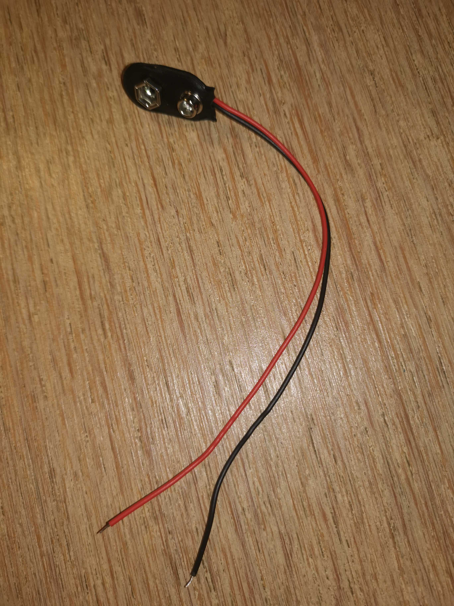
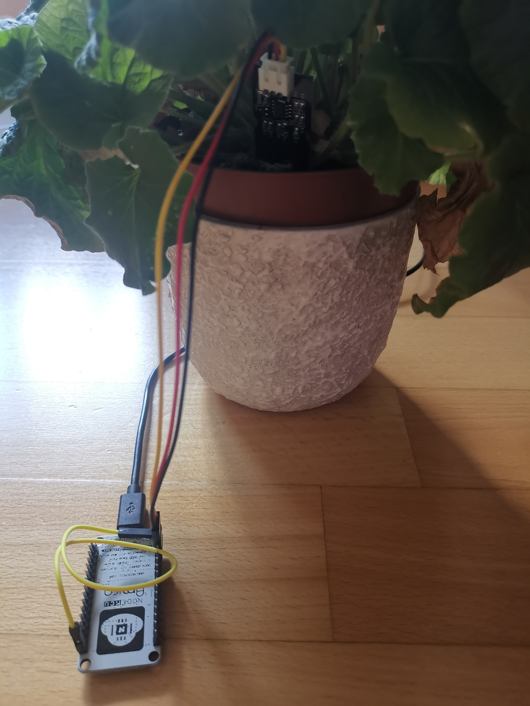
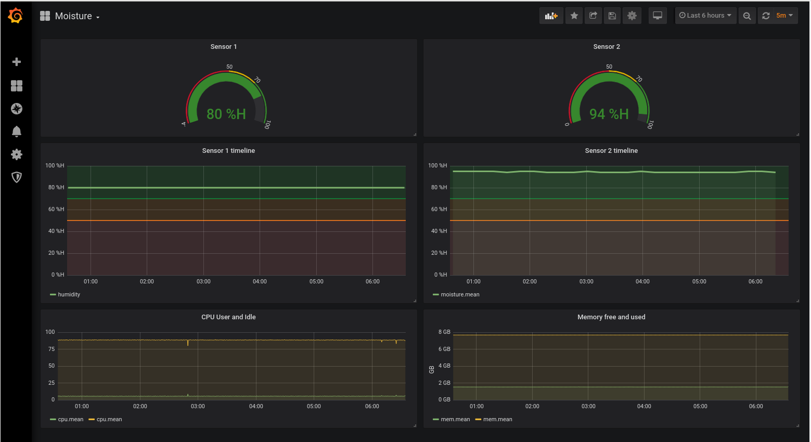

# IoTMoisture
Simple IoT device with an ESP8266 (ESP-12F) and a capacitive soil moisture sensor

## Introduction

This was my Saturday afternoon/evening project. After I thought that my wife is watering plants too often, I thought it would be a good idea to make watering a data driven decision rather than simply "feel" that it needs watering.

So I looked around and found a pretty neat device that had all I required:
- an onboard WIFI
- small in size
- powerable with batteries
- an analog input

Pretty quickly you stumble across pretty cheap devices (approx 2€ at time of writing, when ordered directly through AliExpress) named ESP8266

The choice of moisture sensors is also more than reasonable, there's only 2 types, one that has some rust problem over time and one that is capacitive. This adds 0.5€ more to the bill per device.

The whole solution is based on a kubernetes cluster. You should actually be able to pick any cloud provider and get a k8s cluster from there, however, I decided to get a local copy of [K3s](https://k3s.io).
The ESP8266 connects to a WiFi network and communicates to an [MQTT server](htps://mosquitto.org). The data is sent to an [InfluxDB](https;//wwww.influxdata.com) using their[Telegraf plugin](https://github.com/influxdata/telegraf/tree/master/plugins/inputs/mqtt_consumer). Once the data is in the InfluxDB, you can display the KPI's using [Grafana](https://grafana.com/) which I chose to install via helm.

Overall architecture

## Prerequisites

Useful links, downloads and install:
- Arduino IDE: https://arduino.cc
- ESP8266 Firmware generator:  https://nodemcu-build.com/
- ESP8266 device support for Arduino IDE: http://arduino.esp8266.com/stable/package_esp8266com_index.json

## Hardware

### ESP8266 

There is a bunch of ESP8266 devices on AliExpress and Amazon. The ones that I got are these:

You'll find 2 types with different UART chips, namely CH340 and CP2102. For my purposes, I came to the conclusion that it wouldn't really matter but as the CP2102 is newer, I picked that one, but the CH340 variants should work exactly the same.

### Moisture Sensor

There's no real number or abreviation od any identifiable ID for these. But as there's only 2 types of sensors, one type that's mainly back coated and the other that has holes in it and is mainly whitish or transparent. Those also have  a separated electronics board, while the capacitive ones mostly have their electronics on the sensor board itself.

### Wires

You'll need one additional male-female patch cable for wiring that I had to bend to make if fit:

Connecting the wires is dead-simple. The 3 connectors on the sensor are VCC (3.3 V input), GND (Ground, obviously) and AOUT (the humidity reading as a voltage)
Looking at the board, there's at least 3 pin pairs that offer 3.3V and GND. I picked the ones that made it easy to connect the patch cable.

In order to save power and as moisture will not drop in milliseconds, it's sufficient to get readings every now and then. My impression is that 15min is way more than really required. You can play with it so it works best for you. 

I also use the *deepSleep* mode of the ESP8266, so it only consumes relevant power ever 15 min for a few seconds. This should make the battery last quite some time.

Note: deepSleep mode requires an additional wire from pin D0 to RST. This is required as the timer will reset the device. Note also, that for programming, you want to disconnect the wire.

## Power

I intend to power the devices with a 9V battery using a standard connector that needs to be soldered (or otherwise connected) to *Vin* and *GND*

## References

There's a few things that you may want to look at in more depth:

- Investigate "deep sleep": https://randomnerdtutorials.com/esp8266-deep-sleep-with-arduino-ide/

## Deployment

<todo>

## Monitoring

As outlined above, I decided to use _Grafana_ for monitoring. I added the properties for my dashboard.

## TODOs

- Put everything in a waterproof box
- Check power consumption (deep sleep)

