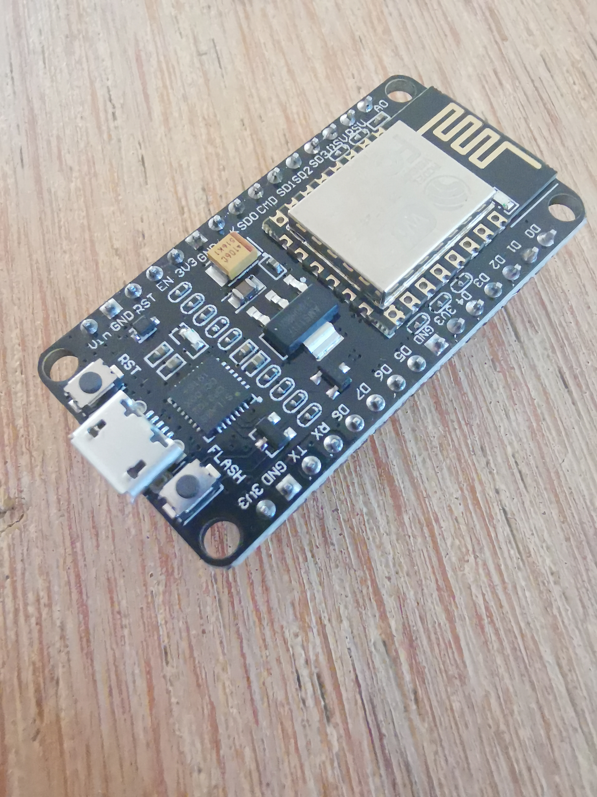
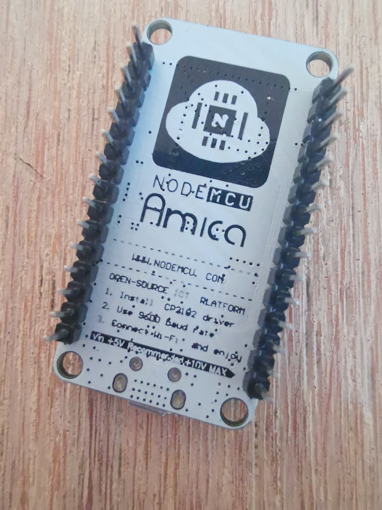
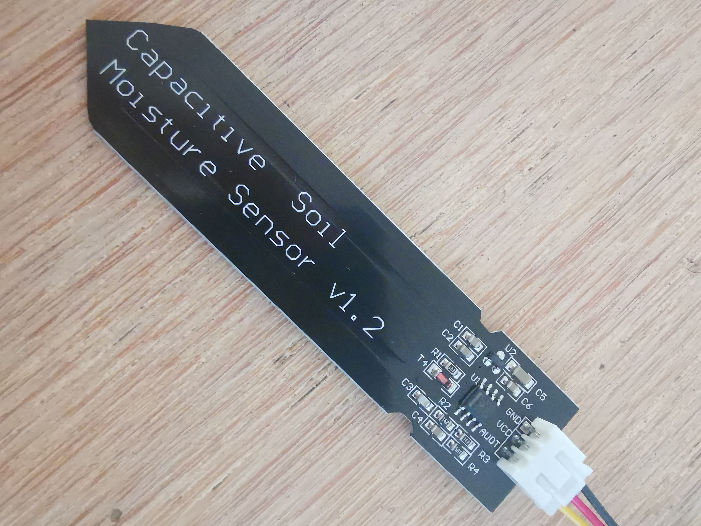
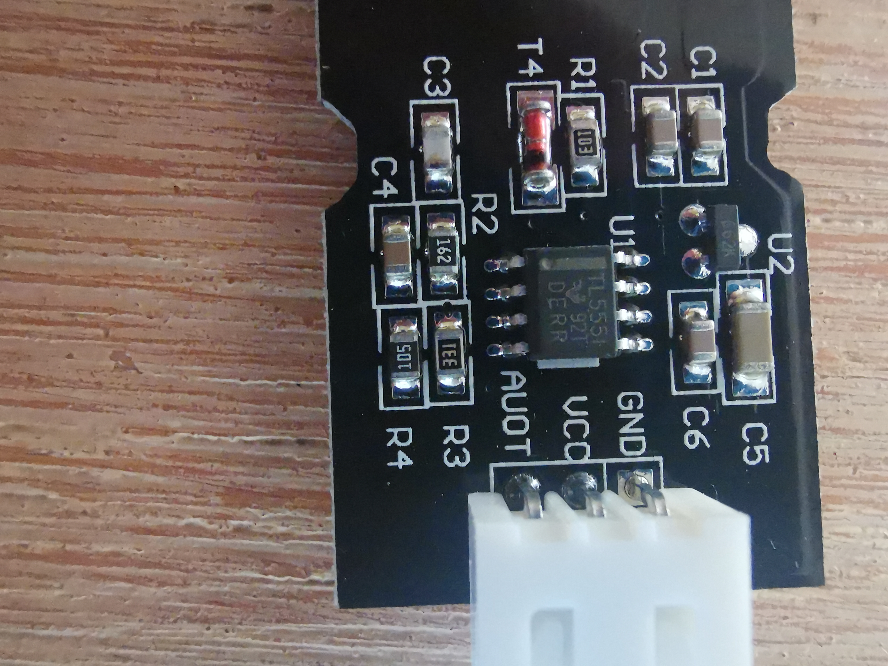
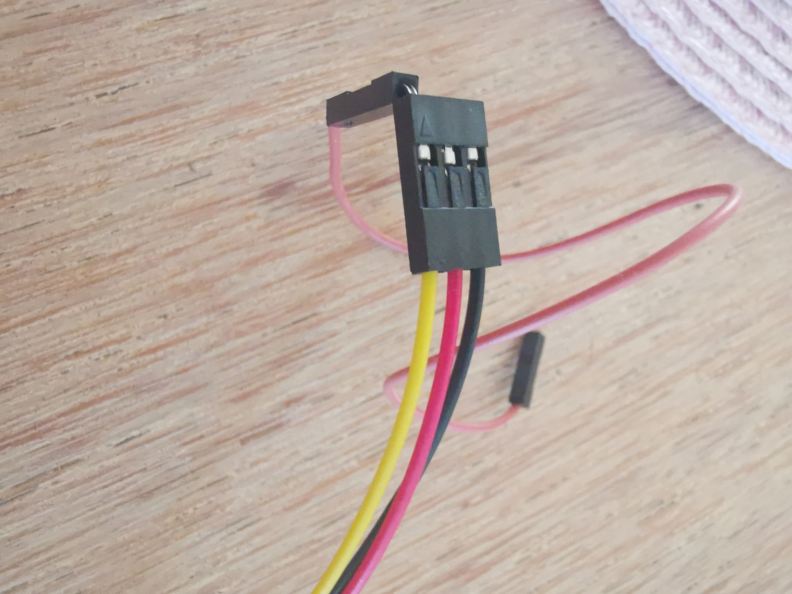
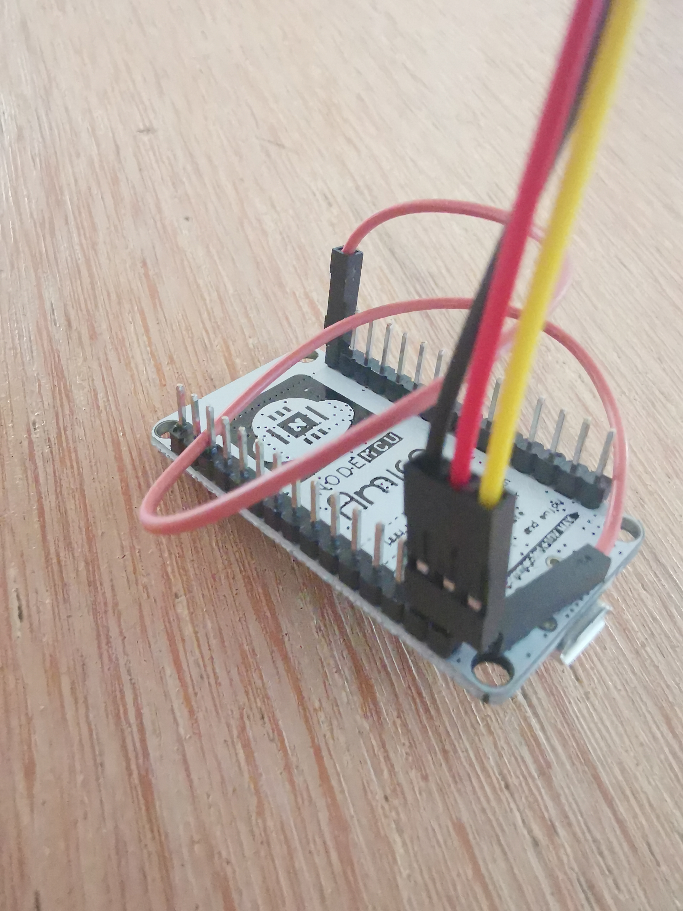
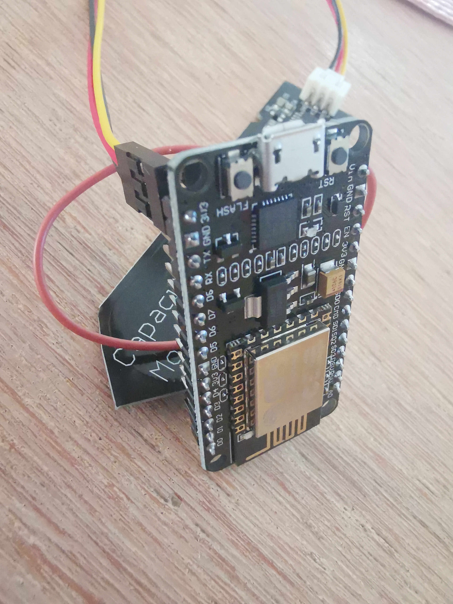
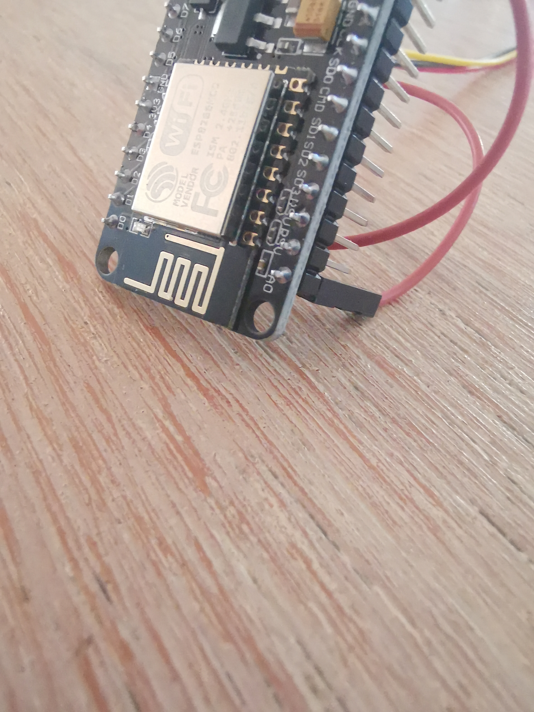

# IoTMoisture
Simple IoT device with an ESP8266 (ESP-12F) and a capacitive soil moisture sensor

## Introduction

This was my Saturday afternoon/evening project. After I thought that my wife is watering plants too often, I thought it would be a good idea to make watering a data driven decision rather than simply "feel" that it needs watering.

So I looked around and found a pretty neat device that had all I required:
- an onboard WIFI
- small in size
- powerable with batteries
- an analog input

Pretty quickly you stumble across pretty cheap devices (approx 2€ at time of writing, when ordered directly through AliExpress) named ESP8266

The choice of moisture sensors is also more than reasonable, there's only 2 types, one that has some rust problem over time and one that is capacitive. This adds 0.5€ more to the bill per device.

## Prerequisites

Useful links, downloads and install:
- Arduino IDE: https://arduino.cc
- ESP8266 Firmware generator:  https://nodemcu-build.com/
- ESP8266 device support for Arduino IDE: http://arduino.esp8266.com/stable/package_esp8266com_index.json
- Dasheroo: https://www.dasheroo.com/

## Hardware

### ESP8266 

There is a bunch of ESP8266 devices on AliExpress and Amazon. The ones that I got are these:

You'll find 2 types with different UART chips, namely CH340 and CP2102. For my purposes, I came to the conclusion that it wouldn't really matter but as the CP2102 is newer, I picked that one, but the CH340 variants should work exactly the same.

### Moisture Sensor

There's no real number or abreviation od any identifiable ID for these. But as there's only 2 types of sensors, one type that's mainly back coated and the other that has holes in it and is mainly whitish or transparent. Those also have  a separated electronics board, while the capacitive ones mostly have their electronics on the sensor board itself.

### Wires

You'll need one additional male-female patch cable for wiring that I had to bend to make if fit:

Connecting the wires is dead-simple. The 3 connectors on the sensor are VCC (3.3 V input), GND (Ground, obviously) and AOUT (the humidity reading as a voltage)
Looking at the board, there's at least 3 pin pairs that offer 3.3V and GND. I picked the ones that made it easy to connect the patch cable.

## Power

I intend to power the devices with a CR2032 There's a nice battery holder named "CR2032 Button Coin Cell Battery Socket Holder Case" which didn't arrive yet, I'll update this with pictures once they are delivered.

## Code improvements

There's a few improvements that you may want to look at:

- SSL: Switch to ESP8266WebServerSecure. This requires a self signed certificate. Alternatively you run the device through a proxy as the SSL endpoint.
- Persistence of the UUID: Persist the UUID so that it is stable across reboots
- Encrypt wifi id/password: To avoid clear text passwordd

## Dashboard/KPI

I used https://www.dasheroo.com. The downside is that you have to provide a certain JSON format for it to work. Another good choice would be freeboard.io, but there's a bunch of others out there.
